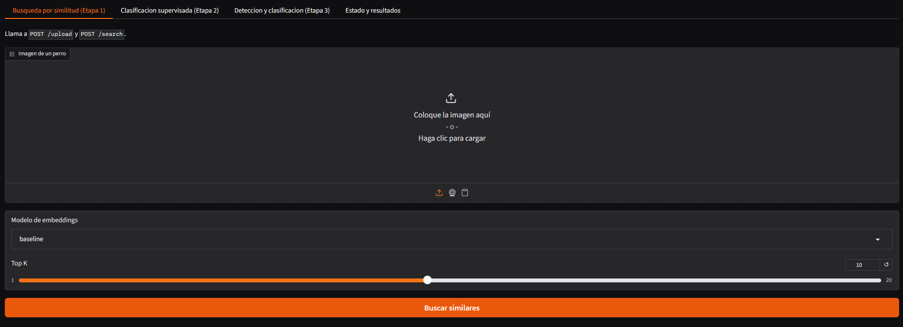
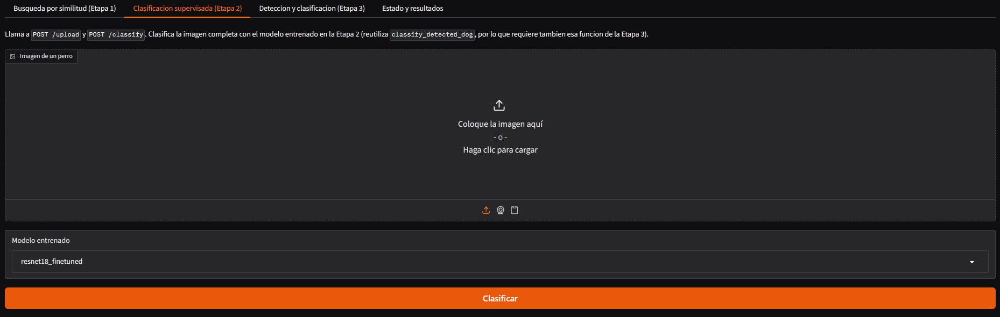
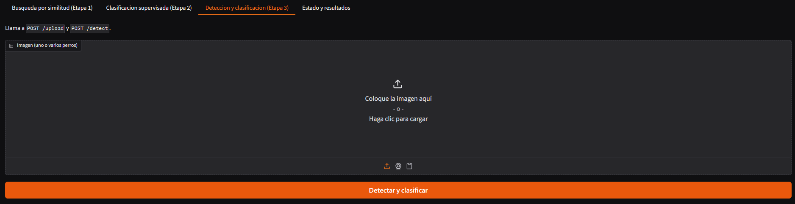

<div align="center">

# Dog Breed Recognition

Pipeline de Computer Vision end-to-end que combina búsqueda por similitud, clasificación
supervisada y detección de objetos para identificar la raza de un perro a partir de una
imagen.


</div>

## Funcionalidades

### Búsqueda por similitud
La primera etapa implementa un sistema de recuperación de imágenes basado en similitud visual. El objetivo consiste en representar cada imagen mediante un vector de características (embedding) extraído por una red neuronal preentrenada y utilizar dicha representación para buscar ejemplos visualmente similares dentro de una base vectorial. A partir de los vecinos recuperados, se estima la raza predominante y se determina si la consulta pertenece o no a la distribución conocida mediante un umbral de similitud. Este enfoque aporta interpretabilidad al sistema, ya que las predicciones pueden justificarse mediante ejemplos concretos recuperados de la base de datos.

<div align="center">

`Imagen de entrada` → `extract_embedding` → `Embedding de consulta` → `search_similar_images` → `Top-K vecinos más similares` → `predict_breed_from_neighbors` → `Raza predicha o "unknown"`

</div>

#### Screenshot de la aplicación

<div align="center"></div>

### Clasificación supervisada
La segunda etapa corresponde al modelo de clasificación supervisada entrenado sobre el dataset 70-Dogs. A diferencia de la búsqueda por similitud, este enfoque aprende directamente una función que asocia una imagen de entrada con una de las razas disponibles en el conjunto de entrenamiento. El pipeline recibe una imagen completa, realiza el preprocesamiento correspondiente y genera una predicción acompañada de su nivel de confianza. Esta etapa constituye el núcleo del sistema de reconocimiento de razas y proporciona inferencias rápidas una vez finalizado el entrenamiento.

<div align="center">

`Imagen de entrada` → `Preprocesamiento` → `classify_image` → `classify_detected_dog` → `Modelo clasificador` → `Raza predicha + confianza` → `Resultado JSON`

</div>

#### Screenshot de la aplicación

<div align="center"></div>

### Detección y clasificación

La tercera etapa extiende el sistema para operar sobre imágenes que pueden contener uno o varios perros. Para ello se incorpora un detector basado en YOLO, encargado de localizar automáticamente cada perro presente en la escena mediante cajas delimitadoras (bounding boxes). Una vez obtenidas las detecciones, cada recorte es procesado individualmente por el clasificador entrenado en la etapa anterior para determinar su raza. Esta combinación permite separar el problema de localización del problema de clasificación, facilitando el procesamiento de escenas más complejas y cercanas a escenarios reales de uso.

<div align="center">

`Imagen de entrada` → `detect_dogs (YOLO)` → `Bounding boxes` → `Recorte de cada detección` → `classify_detected_dog` → `Modelo clasificador` → `Raza de cada perro` → `Resultado final`

</div>

#### Screenshot de la aplicación

<div align="center"></div>


## Arquitectura

| Etapa | Modelo | 
|-------|--------|
| 1. Embeddings + similitud | ConvNeXt-Tiny 
| 2. Clasificación | ResNet18 (fine-tuned) 
| 2. Clasificación (alternativa) | CNN propia (from scratch) | 
| 3. Detección | YOLOv8n + clasificador de etapa 2 |

## Instalación y uso

### Requisitos

- Python 3.12
- Git
- Docker Desktop
- Cuenta de Kaggle

### Opción 1 — Todo en Docker (recomendado)

```bash
docker compose build
docker compose up -d
```

Servicios disponibles:
- Frontend: `http://localhost:8080`
- Backend: `http://localhost:8000`
- Postgres: `localhost:5432`

### Opción 2 — Entorno local

1. **Cloná el repo**

   ```bash
   git clone <url-del-repo>
   cd tuia-dog-recognition-app
   ```

2. **Creá un entorno virtual con Python 3.12**

   ```bash
   # Windows
   python -m venv .venv
   .venv\Scripts\Activate.ps1

   # Linux / Mac
   python3.12 -m venv .venv
   source .venv/bin/activate
   ```

   Alternativa con [uv](https://docs.astral.sh/uv/getting-started/installation/):

   ```bash
   uv venv --python 3.12 .venv
   ```

3. **Instalá las dependencias**

   ```bash
   pip install -r requirements.txt
   # o con uv:
   uv pip install -r requirements.txt
   ```

4. **Configurá las variables de entorno**

   ```bash
   # Linux / Mac
   cp .env.local.example src/.env

   # Windows
   copy .env.local.example src\.env
   ```

5. **Descargá el dataset**

   ```bash
   python scripts/download_dataset.py
   ```

   Requiere [credenciales de Kaggle](https://www.kaggle.com/docs/api) configuradas.
   Dataset: [70 Dog Breeds Image Dataset (Kaggle)](https://www.kaggle.com/datasets/gpiosenka/70-dog-breedsimage-data-set).
   También se puede descargar manualmente y descomprimir `train/`, `valid/` y `test/`
   dentro de `data/dataset`.

6. **Levantá la base de datos** (solo si `USE_PGVECTOR=true`, que es el default)

   ```bash
   docker compose up postgres -d
   ```

   Con `USE_PGVECTOR=false` se usa la base vectorial JSON (`data/embeddings.json`) y no
   hace falta Docker para trabajar localmente.

7. **Descargá los checkpoints entrenados** y colocalos en `models/` (ver `etapa2_colab.ipynb`
   para reentrenar desde cero). Actualizá `RESNET18_MODEL_NAME` y `CNN_CUSTOM_MODEL_NAME`
   en el `.env` con las rutas correspondientes. Soporta modelos `.pth` (PyTorch) y `.onnx`.

8. **Indexá el dataset en la base vectorial**

   ```bash
   python scripts/build_index.py --split train
   ```

9. **Levantá el backend**

   ```bash
   cd src
   uvicorn app.main:app --reload --port 8000
   ```

10. **Levantá el frontend** (en otra terminal, con el venv activado)

    ```bash
    cd src
    uvicorn frontend.app:app --port 8080
    ```

11. **Verificá que todo esté corriendo**

    - Frontend: `http://localhost:8080`
    - Backend: `http://localhost:8000/health` (muestra el modelo seleccionado y los
      checkpoints encontrados)

## Estructura del proyecto

```text
tp2/
├── src/
│   ├── app/
│   │   └── main.py
│   ├── frontend/
│   │   ├── app.py
│   │   └── gradio_ui.py
│   └── lib/
│       ├── api.py
│       ├── bootstrap.py
│       ├── config.py
│       ├── files.py
│       ├── schemas.py
│       ├── evaluation/
│       │   └── metrics.py          # NDCG@10, precision/recall/F1, specificity (provisto)
│       ├── visualization/
│       │   └── draw.py             # dibujo de bounding boxes (provisto)
│       ├── services/
│       │   ├── similarity_service.py   # Etapa 1
│       │   ├── classifier_service.py   # Etapa 2
│       │   ├── detection_service.py    # Etapa 3
│       │   └── task_manager.py
│       └── storage/
│           ├── embedding_store.py      # base vectorial JSON
│           └── pgvector_store.py       # base vectorial PostgreSQL + pgvector
├── scripts/
│   ├── download_dataset.py         # descarga el dataset de Kaggle
│   ├── build_index.py              # indexa el dataset en la base vectorial
│   └── train_classifier.py         # entrena/evalua el clasificador (Etapa 2)
├── data/
│   ├── dataset/                    # 70 Dog Breeds Image Dataset (no se versiona)
│   └── embeddings.json             # base vectorial JSON (si USE_PGVECTOR=false)
├── models/                         # checkpoints entrenados (no se versionan)
├── output/
├── informe.ipynb                   # informe tecnico
├── etapa2_colab.ipynb              # Etapa 2: dataset, preprocesamiento y entrenamiento (Google Colab)
├── requirements.txt
├── Dockerfile
├── Dockerfile.frontend
├── docker-compose.yml
└── .env.docker.example / .env.local.example
```

## Endpoints

| Endpoint | Descripción |
|----------|-------------|
| `POST /upload` | Sube una imagen al servidor |
| `POST /search` | Búsqueda por similitud (acepta `model` y `top_k`) |
| `POST /classify` | Clasificación con el modelo entrenado |
| `POST /detect` | Detección + clasificación |
| `GET /status/{job_id}` | Estado del procesamiento asincrónico |
| `GET /models` | Modelos de embeddings disponibles |
| `GET /health` | Estado del backend |

Los endpoints asincrónicos (`/search`, `/detect`) responden `HTTP 202` con un `job_id`,
que se consulta luego en `/status/{job_id}`:

```json
{
  "status": "done | inProgress | failed",
  "link": "url | none"
}
```

##  Scripts útiles

```bash
# Descargar el dataset de Kaggle a data/dataset
python scripts/download_dataset.py

# Indexar el dataset en la base vectorial
python scripts/build_index.py --split train

# Entrenar y evaluar el clasificador (alternativa a etapa2_colab.ipynb)
python scripts/train_classifier.py --model resnet18_finetuned
```

##  Configuración

Toda la configuración se maneja vía `.env` (no hay parámetros hardcodeados):

- `EMBEDDING_MODEL`: modelo de embeddings usado en la búsqueda por similitud
  (`baseline`, `resnet18_finetuned`, `cnn_custom`)
- `SIMILARITY_THRESHOLD`, `TOP_K`: umbral de similitud y cantidad de vecinos
- `USE_PGVECTOR`: `true` para PostgreSQL + pgvector, `false` para base JSON
- `EMBEDDING_DIM`: debe coincidir con la dimensión del modelo elegido; al cambiar de
  modelo hay que reindexar (`scripts/build_index.py`)
- `RESNET18_MODEL_NAME`, `CNN_CUSTOM_MODEL_NAME`: rutas a los checkpoints en `models/`